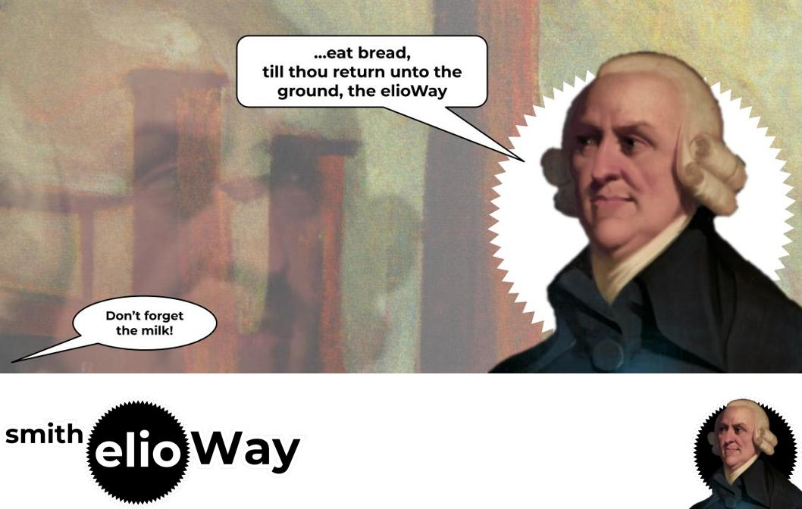

# smith

Webdev's \"hello world\", a TODO app, `Action`, the elioWay.

- [smith Documentation](./doc/index.md)

## Seeing is Believing

```
cd ~/Dev/theelioway/smith
```

- [smith Quickstart](./quickstart.md)

## Prerequisites

- [smith Prerequisites](./prerequisites.md)

## Installing

- [Installing smith](./installing.md)

# Credits

- [smith Credits](./credits.md)

## License

[MIT](license)


